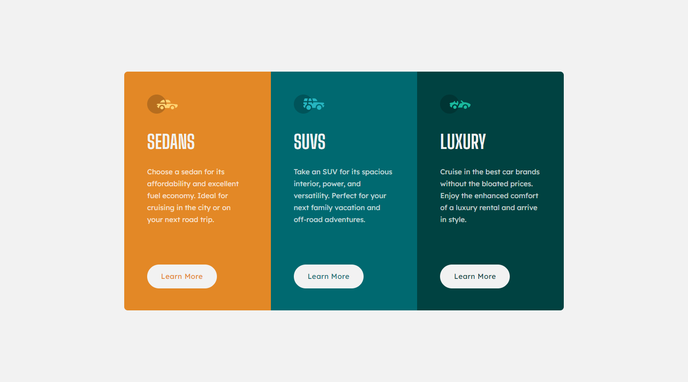
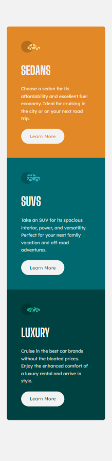

# Frontend Mentor - 3-column preview card component solution

This is a solution to the [3-column preview card component challenge on Frontend Mentor](https://www.frontendmentor.io/challenges/3column-preview-card-component-pH92eAR2-). Frontend Mentor challenges help you improve your coding skills by building realistic projects.

## Table of contents

- [Overview](#overview)
  - [The challenge](#the-challenge)
  - [Screenshot](#screenshot)
  - [Links](#links)
- [My process](#my-process)
  - [Built with](#built-with)
  - [What I learned](#what-i-learned)
- [Author](#author)

## Overview

### The challenge

Users should be able to:

- View the optimal layout depending on their device's screen size
- See hover states for interactive elements

### Screenshot

Taken with [FireShot](https://getfireshot.com/)

### Links

- Solution URL: [Solution Repo](https://github.com/kemenyfa-szu/frontendmentor-008-car-rent-landingpage)
- Live Site URL: [Live Site](https://kemenyfa-szu.github.io/frontend-mentor/008-car-rend-landingpage/)

## My process

### Built with

- Semantic HTML5 markup
- SCSS
- Flexbox
- Mobile-first workflow
- [Angular](https://angular.io/) - Framework

### What I learned

- Understanding the main strukture of Angular.
- Creating new angular compontents.
- Styling angular components with SASS.

## Author

- Website - [My Github Page](https://kemenyfa-szu.github.io/)
- Frontend Mentor - [@kemenyfa-szu](https://www.frontendmentor.io/profile/kemenyfa-szu)
